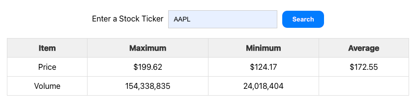
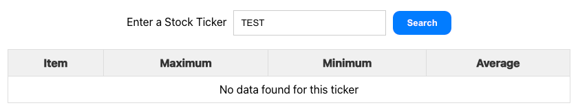

# Portrait Stock
Portrait Stock is a single-page application that allows users to enter a stock ticker symbol and view the maximum, minimum, and average price and volume data for a specified date range. This application is designed to provide a quick and efficient way to get key financial metrics for a given stock.

## Tech Stack
- **TypeScript** 
- **React**: for building user interfaces.
- **Redux**: toolset for efficient Redux development 
- **Axios**: HTTP client for the browser and node.js 
- **Jest**: Testing library

## Component Structure
- **StockInput**: This component is responsible for rendering the stock ticker input and handling the form submission.
- **StockDisplay**: This component displays the stock data in a table format. It conditionally renders either the data table or an error message, based on the received props:

## How to run
1. Install necessary dependencies:
```shell
$ npm install
```
2. Run the application:
```shell
$ npm start
```
Then you can access it on http://localhost:3001/ (probably the server side will be running on port 3000, so the client side will be running on 3000, so that's why the client side is running on the next available port.)

## Running tests
The following command will launch the test runner in the interactive watch mode.

```shell
$ npm test
```

## Screenshots
Below are two screenshots demonstrating the application's functionality:

### Table Populated with Data:
This screenshot shows the application's table populated with stock data for a valid ticker.


### Error Message on Invalid Ticker:
This screenshot displays the user-friendly error message when no data is found for the entered stock ticker.
